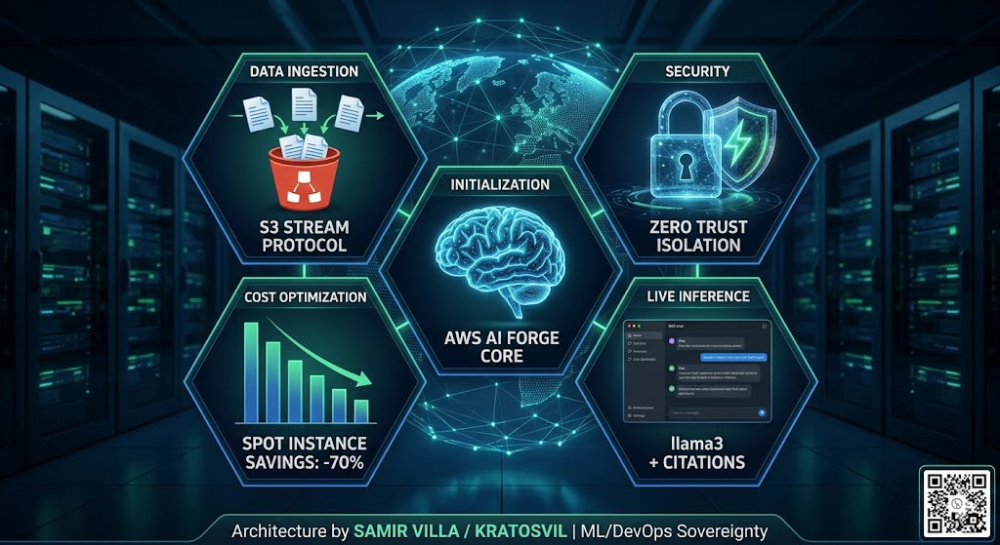

# aws-ai-forge

Fully managed RAG (Retrieval-Augmented Generation) platform on AWS. Documents uploaded to S3 are automatically indexed and made queryable in natural language — no document key required.



> End-to-end RAG platform: automatic document ingestion via S3, Bedrock Knowledge Bases + OpenSearch Serverless, WAF edge security, Zero Trust isolation, Spot-based cost optimization and live inference with citations.

## Architecture

```
Internet
    │
    ▼
WAF Web ACL (OWASP Top 10 + Known Bad Inputs)
    │
    ▼
Application Load Balancer          (public subnets)
    │
    ▼
FastAPI — ECS Fargate              (private subnets, Auto Scaling min1/max3)
    │
    ├── POST /ask  ──► Lambda bedrock_handler ──► Bedrock InvokeModel (legacy)
    │
    └── POST /search ► Lambda kb_query_handler ► Bedrock RetrieveAndGenerate
                                                        │
                                              Bedrock Knowledge Base
                                                        │
                                          OpenSearch Serverless (AOSS)
                                                        │
S3 upload ──► Lambda kb_sync_handler ──► StartIngestionJob ──────────┘
```

All internal traffic (ECS → Lambda → S3 → Bedrock) flows through **VPC Endpoints** — no NAT Gateway, no public exposure.

## Tech Stack

| Layer | Technology |
|-------|-----------|
| IaC | Terraform >= 1.5 (modular, one module per component) |
| API Compute | ECS Fargate + Auto Scaling (CPU target tracking) |
| AI Compute | AWS Lambda (Python 3.12) + X-Ray distributed tracing |
| API Framework | FastAPI + Uvicorn |
| RAG Engine | Amazon Bedrock Knowledge Bases |
| Vector Store | OpenSearch Serverless (VECTORSEARCH collection) |
| Embeddings | Titan Text Embeddings v2 (dimension 1024, HNSW/faiss) |
| Generation | Amazon Bedrock — Claude 3 Haiku |
| Container Registry | Amazon ECR (immutable tags, scan on push) |
| Storage | Amazon S3 (SSE-S3, versioning, lifecycle) |
| Networking | VPC, ALB, VPC Endpoints (no NAT Gateway) |
| Security | Least-privilege IAM, WAF OWASP Top 10, SSE-S3 |
| Observability | CloudWatch Dashboard + 7 Alarms + SNS + X-Ray |
| Container | Docker multi-stage build, non-root user |

## Repository Structure

```
aws-ai-forge/
├── app/
│   ├── main.py                  # FastAPI — /health /ask /search /version
│   ├── Dockerfile               # Multi-stage build, non-root user (uid 1001)
│   └── requirements.txt
├── lambda/
│   ├── bedrock_handler.py       # v1 — InvokeModel with document context
│   ├── kb_query_handler.py      # v2 — RetrieveAndGenerate via Bedrock KB
│   └── kb_sync_handler.py       # v2 — StartIngestionJob on S3 upload
└── terraform/
    ├── main.tf                  # Orchestrator — module calls only
    ├── variables.tf
    ├── outputs.tf
    └── modules/
        ├── vpc/                 # VPC, subnets, IGW, route tables, VPC Endpoints, SGs
        ├── alb/                 # ALB, target group, HTTP:80 listener
        ├── iam/                 # ECS roles, Lambda invoke permissions, X-Ray
        ├── s3/                  # Bucket with SSE, versioning, lifecycle, deny non-TLS
        ├── ecr/                 # ECR with immutable tags and scan on push
        ├── lambda/              # bedrock_handler + CloudWatch Log Group
        ├── ecs/                 # Cluster, task definition, Fargate service, Auto Scaling
        ├── knowledge_base/      # AOSS collection + Bedrock KB + IAM service role
        ├── kb_lambda/           # kb_query_handler + kb_sync_handler + S3 trigger
        ├── monitoring/          # CloudWatch Dashboard + Alarms + SNS
        └── waf/                 # WAF Web ACL + ALB association
```

## API Endpoints

| Method | Endpoint | Description |
|--------|----------|-------------|
| `GET` | `/health` | Health check — used by ALB target group |
| `GET` | `/version` | Service version and region |
| `POST` | `/ask` | Query a specific document by key (v1 legacy) |
| `POST` | `/search` | Natural language search across all indexed documents (v2 RAG) |

### /search — RAG Query (v2)

Upload a document once. Query it in natural language — no document key needed.

```bash
# 1. Upload a document (triggers automatic indexing)
aws s3 cp my-document.txt s3://<bucket-name>/my-document.txt

# 2. Wait ~30s for the ingestion job to complete, then query
curl -X POST http://<alb-dns>/search \
  -H "Content-Type: application/json" \
  -d '{"question": "What does the document say about X?"}'
```

```json
{
  "answer": "Based on the provided context, X refers to...",
  "citations": [],
  "retrieved_chunks": 0,
  "model_id": "anthropic.claude-3-haiku-20240307-v1:0"
}
```

The model answers **only** based on indexed document content. If the answer is not in the corpus, it states so explicitly.

### /ask — Document Query (v1 legacy)

```bash
curl -X POST http://<alb-dns>/ask \
  -H "Content-Type: application/json" \
  -d '{"question": "Summarize this document", "document_key": "docs/report.txt"}'
```

```json
{
  "answer": "The document covers...",
  "model_id": "anthropic.claude-3-haiku-20240307-v1:0",
  "document_key": "docs/report.txt",
  "input_tokens": 173,
  "output_tokens": 108
}
```

## Deployment

### Prerequisites

- AWS CLI configured (`aws configure`)
- Terraform >= 1.5
- Docker

### 1. Infrastructure

```bash
cd terraform
terraform init
terraform plan
terraform apply
```

> OpenSearch Serverless requires at least one active OCU (On-demand Compute Unit). Minimum charge: ~$0.24/OCU-hour x 4 OCUs = ~$0.96/hr.

### 2. Docker Image

```bash
# Login to ECR
aws ecr get-login-password --region us-east-1 | docker login --username AWS --password-stdin <ecr-url>

# Build, tag and push
docker build -t aws-ai-forge-dev-api ./app
docker tag aws-ai-forge-dev-api:latest <ecr-url>:latest
docker push <ecr-url>:latest
```

### 3. Deploy to ECS

```bash
aws ecs update-service --cluster aws-ai-forge-dev-cluster --service aws-ai-forge-dev-api-service --force-new-deployment --region us-east-1
```

### 4. Index a document

```bash
# Upload triggers kb_sync_handler automatically
aws s3 cp docs/my-document.txt s3://<bucket-name>/my-document.txt

# Monitor ingestion (replace IDs with your terraform outputs)
aws bedrock-agent get-ingestion-job \
  --knowledge-base-id <kb-id> \
  --data-source-id <ds-id> \
  --ingestion-job-id <job-id> \
  --region us-east-1 \
  --query 'ingestionJob.{status:status,stats:statistics}'
```

### Terraform Outputs

```bash
terraform output api_endpoint          # Public service URL
terraform output ecr_repository_url    # ECR repository URL
terraform output s3_bucket_name        # Documents bucket name
terraform output knowledge_base_id     # Bedrock KB ID
terraform output data_source_id        # KB data source ID
```

## Architecture Decisions

- **Bedrock Knowledge Bases** — fully managed RAG: chunking, embedding, indexing and retrieval are handled by AWS. No infrastructure to maintain for the vector pipeline.
- **OpenSearch Serverless** — managed vector store with automatic scaling. No cluster administration, no capacity planning.
- **Titan Text Embeddings v2** — native AWS embedding model (1024 dimensions, HNSW/faiss). No external API dependencies for the embedding step.
- **S3 trigger → automatic ingestion** — `kb_sync_handler` fires on `s3:ObjectCreated`. Documents are indexed without manual intervention, with UUID-based `clientToken` for idempotency on retries.
- **No NAT Gateway** — VPC Endpoints for S3, ECR, CloudWatch, Bedrock, Lambda and AOSS. Saves ~$32/month and keeps all traffic within the AWS network.
- **WAF on ALB edge** — OWASP Top 10 (CommonRuleSet) and Known Bad Inputs managed rule groups. Protects against SQL injection, XSS, Log4Shell, JNDI exploits and path traversal.
- **ECS Auto Scaling** — target tracking on CPU 70%, min 1 / max 3 tasks. Scales in under load, scales out when idle to minimize cost.
- **X-Ray distributed tracing** — Active mode on all three Lambda functions. End-to-end request tracing from ECS → Lambda → Bedrock.
- **Least-privilege IAM** — each role (ECS task, KB service, kb_query, kb_sync) scoped to exact ARNs. No open wildcards.
- **AOSS access policy** — network policy set to `AllowFromPublic` with real access control enforced via IAM data access policies. Required for Bedrock KB to reach the collection from its service network.

## Security Highlights

| Layer | Controls |
|-------|---------|
| Edge | WAF Web ACL — OWASP Top 10, Known Bad Inputs |
| Network | Security Groups, no public IP on ECS tasks, ALB-only inbound |
| Storage | S3 public access blocked (4 levels), SSE-S3, deny non-TLS bucket policy |
| Registry | ECR scan on push, immutable tags, account-scoped policy |
| IAM | Separate roles per component, ARN-scoped permissions, no wildcards |
| Container | Non-root user (uid 1001), multi-stage build, minimal base image |
| API | Swagger UI disabled, global exception handler (no stack traces in responses) |

## Observability

- **CloudWatch Dashboard** — 9 widgets: Lambda invocations/errors/duration/throttles, ECS CPU/memory, ALB requests/5XX/latency/healthy hosts
- **7 Alarms** — Lambda error rate (x3 functions), Lambda duration, ECS CPU > 80%, ECS Memory > 85%, ALB 5XX rate > 5%, ALB unhealthy hosts
- **SNS notifications** — alarm state changes delivered via email
- **X-Ray traces** — end-to-end request map across Lambda and Bedrock calls

## Estimated Lab Cost

| Resource | Cost |
|---------|------|
| OpenSearch Serverless (min 4 OCU) | ~$0.96/hr |
| VPC Interface Endpoints (5 endpoints × 2 AZs) | ~$0.10/hr |
| ALB | ~$0.008/hr |
| ECS Fargate (0.25 vCPU / 512 MB) | ~$0.012/hr |
| WAF Web ACL | ~$0.006/hr + $0.60/million requests |
| Lambda + Bedrock | ~$0.0002/query |

> **Run `terraform destroy` after the demo.** OpenSearch Serverless charges a minimum of 4 OCU/hour regardless of traffic.
